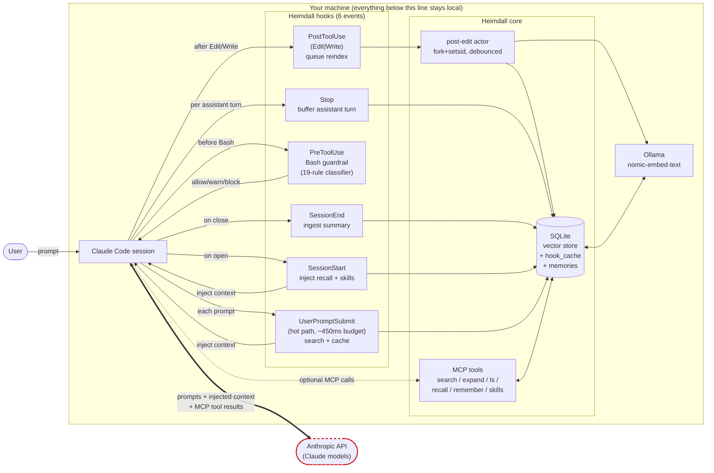
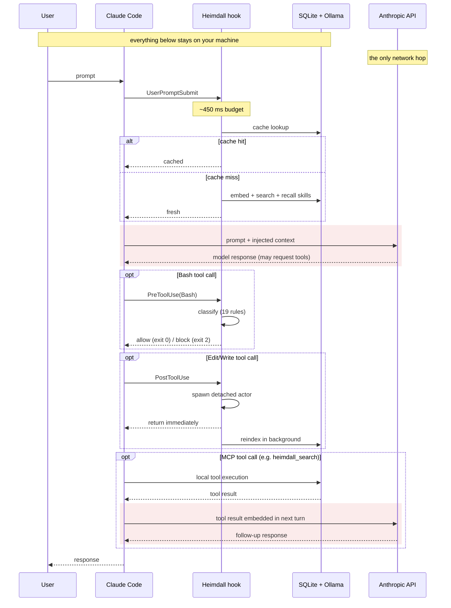

# heimdall-mcp

Local semantic code search + persistent memory for Claude Code, powered by [Ollama](https://ollama.ai) embeddings (nomic-embed-text) and a SQLite vector store.

**Heimdall itself makes no cloud calls** — indexing, embedding, search, memory, and hooks all run on your machine. Claude Code still sends the conversation (including Heimdall's injected context and MCP tool results) to the Anthropic API, because that's how Claude Code works. The privacy boundary to be aware of is Claude Code's, not Heimdall's. See [Network Interactions](#network-interactions) for a full breakdown.

## How it works

Heimdall surfaces context automatically on every relevant Claude Code event via six hooks, backed by a local SQLite vector store and Ollama for embeddings. Claude doesn't have to remember to call MCP tools — the context arrives in the prompt itself.



The thick double arrow between **Claude Code** and the **Anthropic API** is the only path that leaves your machine while a session is running. Everything Heimdall does — the hook injection, the MCP tool execution, the embedding via Ollama, the SQLite reads and writes — runs locally. What crosses the network is whatever Claude Code sends as part of the conversation: your prompts, Heimdall's injected `## Heimdall context` blocks, and any MCP tool results Claude chooses to call.

**Per-turn lifecycle** (from user prompt to Claude's response):



The red-tinted bands are the only steps that leave your machine. All Heimdall work (hook execution, embedding, search, tool results) happens locally; Claude Code is what sends the conversation to the Anthropic API.

**Key properties:**
- **Retrieval hooks always exit 0** — a slow or broken hook never blocks Claude Code.
- **Tier B suppression** — if Ollama goes down, the hook emits one "unavailable" note then stays silent for 5 minutes per (project, failure) pair.
- **Tiered retrieval** — `detail=summary|snippet|full` on `heimdall_search` reduces output tokens by ~62% at typical expansion rates. Drill down with `heimdall_expand(chunk_id)`.
- **Destructive-op guardrails** — `PreToolUse(Bash)` classifies commands against 19 static rules (`rm -rf /`, `git push --force` on protected branches, `DROP DATABASE`, etc.). Default is shadow mode: logs verdicts, never blocks. Toggle via `HEIMDALL_GUARDRAILS=shadow|warn|block|off`.

The `UserPromptSubmit` hook runs under a 450 ms budget (default), with a design target of p95 latency ≤ 250 ms; the extra headroom absorbs cold-model or network variance without tripping Claude's hook timeout.

## Prerequisites

- [Go 1.25+](https://go.dev/dl/)
- [Ollama](https://ollama.ai) installed and running (e.g. `ollama serve` in another terminal, or started as a system service)
- An embedding model pulled: `ollama pull nomic-embed-text` (default, recommended)

### Network Interactions

Heimdall is local-first. There are three distinct boundaries worth keeping straight:

**Stays on your machine (what Heimdall actually does):**

- Embedding generation (Ollama at `http://localhost:11434`, configurable via `ollamaEndpoint`)
- SQLite vector store + memory store (under `.heimdall_db/` and `~/.config/heimdall-mcp/`)
- Hook execution (the six `SessionStart`/`UserPromptSubmit`/`PreToolUse`/`PostToolUse`/`Stop`/`SessionEnd` handlers)
- MCP tool execution (`heimdall_search`, `heimdall_index`, `heimdall_recall`, `heimdall_remember`, etc.)
- Git commit indexing, content lifecycle pruning, the Bash guardrail classifier
- The optional LLM classifier fallback (`HEIMDALL_LLM_CLASSIFIER=1`) — runs against your local Ollama, never a cloud model

No telemetry, no API keys, no third-party services. Heimdall has no outbound network code paths other than the Ollama endpoint you configure.

**Leaves your machine via Claude Code (not via Heimdall):**

Claude Code sends the conversation — everything the model needs to respond — to the Anthropic API. Heimdall's outputs become part of that conversation:

- Hook-injected `## Heimdall context` blocks (attached to `SessionStart` and `UserPromptSubmit`)
- MCP tool results (what `heimdall_search`/`heimdall_recall`/`heimdall_expand`/etc. return)
- Anything you type

If a snippet, file path, commit message, or memory appears in Claude's reply, it was sent to the Anthropic API on the turn Claude referenced it. That's Claude Code's data boundary, not Heimdall's — Heimdall can't see or influence what Claude Code sends.

**One-time setup (touches the internet once):**

- `go install github.com/caio-silva/heimdall-mcp@latest` — downloads the binary from the Go module proxy
- `ollama pull <model>` — downloads the embedding model into your local Ollama
- `git clone` / `git pull` — standard Git operations against your remotes

No cloud APIs from Heimdall, no keys to configure, no telemetry. The only dial-out after setup is whatever Claude Code itself does.

## Install

```bash
go install github.com/caio-silva/heimdall-mcp@latest
```

Or build from source:

```bash
git clone https://github.com/caio-silva/heimdall-mcp.git
cd heimdall-mcp
make build
```

## Connect to Claude Code

```bash
claude mcp add heimdall /path/to/heimdall-mcp
```

Then just start using Claude. Heimdall auto-indexes your project on first search — no manual setup needed. It also tells Claude to silently index any external content (Jira tickets, Slack messages, PRs, etc.) it reads via other MCP tools.

## MCP Tools

| Tool | Description |
|---|---|
| `heimdall_search` | Semantic search over indexed code, external content, and memories. Auto-indexes on first use. Supports `source_type` and `metadata_filter`. |
| `heimdall_index` | Index a directory in the background. Auto-detects git repos and indexes recent commits. |
| `heimdall_index_text` | Index external content (Jira tickets, docs, PRs, Slack messages, etc.) with typed metadata and relationships. |
| `heimdall_status` | Ollama reachability, model status, index stats, indexing progress, registered projects. |
| `heimdall_projects` | List all projects in the registry. |
| `heimdall_remember` | Store a memory for persistent recall across sessions. Supports tags, types, project scoping, and an optional `context_path` (slash-separated subpath within a project). |
| `heimdall_recall` | Retrieve memories by semantic search with optional type/tag/project filters. |
| `heimdall_ingest_session` | Auto-extract memories from a conversation summary. Deduplicates against existing memories. |
| `heimdall_explain` | Deep diagnostic for a search query — score distribution, source counts, timing, related items. |
| `heimdall_configure` | Get or set Heimdall config. Supports dot-notation keys like `git.depth` or `lifecycle.active_days`. |
| `heimdall_manage_paths` | Add, remove, or list directories to index. |
| `heimdall_expand` | Expand a chunk by ID to get its full content. Use after searching with `detail=summary` or `detail=snippet` to drill down into a specific result. |
| `heimdall_ls` | List the context path hierarchy — filesystem-style navigation of indexed content, with chunk counts at each directory level. |

## Smart Defaults

Heimdall works out of the box with no configuration:

- **Auto-index on first search** — When you search and no index exists, Heimdall starts indexing your current directory automatically. It returns "indexing started" and the next search hits the populated index.
- **Git commit indexing** — If your project has a `.git/` directory, the last 200 commits are indexed automatically alongside your code. Commit messages become searchable.
- **Stale index detection** — If your index is older than 30 minutes, Heimdall triggers a background re-index on the next search. Current results are returned immediately.
- **Silent external content capture** — The MCP initialize response instructs Claude to automatically call `heimdall_index_text` whenever it reads external content from other MCP tools (Jira, Slack, Confluence, GitHub, etc.).

## Session Memory

Heimdall maintains a persistent memory store across sessions:

```
"Remember that the user prefers TDD workflow"
→ heimdall_remember stores it as type: "preference"

"What do I know about this user's preferences?"
→ heimdall_recall finds it via semantic search

"Here's a summary of our conversation..."
→ heimdall_ingest_session auto-extracts and deduplicates memories
```

Memory types: `preference`, `decision`, `fact`, `context`, `skill`. Memories can be scoped to projects and tagged for filtering. Skills are surfaced automatically via `SessionStart` and `UserPromptSubmit` hooks; the other four types are retrievable via `heimdall_recall`'s `type` filter.

The memory database lives at `~/.config/heimdall-mcp/memories.db` (respects `$XDG_CONFIG_HOME`; falls back to `$TMPDIR/heimdall-mcp/memories.db` if no home directory can be resolved).

## Hooks integration

Heimdall ships a one-shot `install-hooks` command that wires six hook events into Claude Code's `.claude/settings.json`. Once installed, Heimdall context arrives in Claude's prompt automatically on every relevant event — the model never has to remember to call a search tool. See the diagram under "How it works" for the full data flow.

```bash
# Install hooks for this project (+ pre-warm Ollama)
heimdall-mcp install-hooks --scope=project

# Preview without writing
heimdall-mcp install-hooks --scope=project --dry-run

# Diagnose
heimdall-mcp hooks doctor            # 14-check health table
heimdall-mcp hooks tail --since=1h   # filter by --event, --project, --level
heimdall-mcp hooks explain-command "rm -rf /"  # dry-run the guardrail classifier

# Uninstall (reverts to backup)
heimdall-mcp uninstall-hooks --scope=project
```

Pre-warm is best-effort with a 5-second cap: if Ollama is cold or unreachable the install still succeeds, and the first `SessionStart` hook may take 60+ seconds to load the model on demand (one-time; subsequent hooks are fast).

Hook subcommands dispatched by `heimdall-mcp hook <sub>`:

- `session-start`
- `user-prompt`
- `pre-tool-use`
- `post-edit`
- `post-edit-actor` (internal — spawned by `PostToolUse` for async reindexing)
- `stop`
- `session-end`

End users never invoke these directly — Claude Code runs them via `settings.json`.

**Hooks are opt-in.** They never block Claude Code from starting. Retrieval hooks always exit 0; only `PreToolUse` in `block` mode can return exit 2, and only on a genuinely destructive Bash command.

Toggle guardrails with `HEIMDALL_GUARDRAILS=shadow|warn|block|off` (default: `shadow` — logs verdicts, never blocks). `block` also accepts `1`, `on`, `enforce`; `off` also accepts `0` or empty. Disable all hooks with `HEIMDALL_HOOKS=0` or drop a `.heimdall/hooks.disabled` marker in your project.

**LLM classifier fallback (opt-in).** When the static 19-rule classifier returns `ClassUnknown`, an optional second pass can consult a local Ollama instruct model for a sharper verdict. Enable with `HEIMDALL_LLM_CLASSIFIER=1` and point it at a pulled model via `heimdall-mcp configure --llm-classifier-model=<model>` (e.g. `llama3.2:3b`). The fallback is local-only — queries never leave the machine and there is no cloud API. See [`docs/reference/llm-classifier.md`](docs/reference/llm-classifier.md) for latency, failure modes, and the full rollout plan.

**Hook log.** Structured JSON-lines events go to `~/.local/state/heimdall/hooks.log` (honors `$XDG_STATE_HOME`; override the full path with `HEIMDALL_HOOK_LOG`). Logs auto-rotate at 10 MB; the previous log is retained as `hooks.log.1`. Cached hook output is capped at 32 KB per row — larger payloads are refused rather than truncated.

### Per-session savings

After a Claude Code session, run:

```bash
heimdall-mcp sessions list
heimdall-mcp sessions report --session-id=<id>
```

The `report` command joins the session transcript (tokens, tool calls, `hook_success` attachment bytes) with `hooks.log` (cache hits, guardrail verdicts, reindex events) and prints a per-session summary. `--format=json` is available for scripting.

## Skills

Heimdall indexes [Claude Code skills](https://docs.anthropic.com/claude/claude-code/skills) as a searchable memory type so top-N relevant skills surface in the `SessionStart` and `UserPromptSubmit` hooks:

```bash
# Import ~/.claude/skills/*/SKILL.md into Heimdall
heimdall-mcp skills import

# Preview
heimdall-mcp skills import --dry-run --format=json
```

The MCP `heimdall_remember --type=skill` accepts `write_file=true` to write a new skill back to `~/.claude/skills/<slug>/SKILL.md` — two-way sync, opt-in per call.

## Content Lifecycle

Indexed content follows a three-stage lifecycle to prevent unbounded growth:

| Stage | Condition | What Happens |
|-------|-----------|--------------|
| **Active** | Accessed within 30 days | Full content, full embedding, scores normally |
| **Archived** | >30 days to ≤90 days since last access | Content compressed to 200 chars. Still searchable. Claude can re-fetch from source if needed. |
| **Pruned** | >90 days since last access | Deleted entirely |

- **Code and memory entries are exempt** — they never get archived or pruned.
- **Relevance decay** — Search scores factor in freshness: `final_score = cosine_similarity × freshness_weight`, where `freshness_weight` decays linearly from 1.0 (fresh) to 0.5 at ≥90 days old. New or never-accessed content is not penalized.
- **Size cap** — 10,000 chunks per project. When exceeded, the oldest external entries are pruned first.
- **Lifecycle runs automatically** on each search, throttled to once per hour.

All thresholds are configurable via `heimdall_configure`.

## CLI Usage

```bash
# Index a project
heimdall-mcp index /path/to/project

# Index with a custom DB location
heimdall-mcp index /path/to/project --out /tmp/my-index

# Search indexed files
heimdall-mcp search "payment processing logic"

# Check Ollama status and index stats
heimdall-mcp status

# List all registered projects
heimdall-mcp projects

# View full config
heimdall-mcp config get

# View a specific config key
heimdall-mcp config get git.depth

# Set a config value
heimdall-mcp config set git.depth 500
heimdall-mcp config set lifecycle.active_days 14

# Manage indexed paths
heimdall-mcp paths list
heimdall-mcp paths add /path/to/another/project
heimdall-mcp paths remove /path/to/another/project
```

## Configuration

Optional. Heimdall works with zero config — defaults to local Ollama with nomic-embed-text.

Create `~/.config/heimdall-mcp/config.json` or use `heimdall_configure` / `heimdall-mcp config set`:

```json
{
  "ollamaEndpoint": "http://localhost:11434",
  "model": "nomic-embed-text",
  "contextDepth": 1,
  "maxContextTokens": 4096,
  "excludePatterns": [".git", "node_modules", "vendor", ".heimdall_db", "__pycache__", ".idea", ".claude/worktrees"],
  "gitEnabled": true,
  "gitDepth": 200,
  "gitIncludeDiffs": false,
  "gitBranches": [],
  "staleTimeoutMinutes": 30,
  "lifecycleActiveDays": 30,
  "lifecycleArchiveDays": 90,
  "maxChunksPerProject": 10000,
  "embedBatchSize": 32,
  "indexedPaths": []
}
```

Or set `HEIMDALL_MCP_CONFIG=/path/to/config.json`.

Config precedence:
1. `$HEIMDALL_MCP_CONFIG` env var
2. `$XDG_CONFIG_HOME/heimdall-mcp/config.json`
3. `~/.config/heimdall-mcp/config.json`

### Config keys (for `heimdall_configure` / `config set`)

| Key | Type | Default | Description |
|-----|------|---------|-------------|
| `git.enabled` | bool | `true` | Index git commits during `heimdall_index` |
| `git.depth` | int | `200` | Number of recent commits to index |
| `git.include_diffs` | bool | `false` | Include diffs in commit content (reserved) |
| `git.branches` | []string | `[]` | Branches to index (empty = current only) |
| `stale_timeout_minutes` | int | `30` | Minutes before an index is considered stale |
| `lifecycle.active_days` | int | `30` | Days before content is archived |
| `lifecycle.archive_days` | int | `90` | Days before content is pruned |
| `max_chunks_per_project` | int | `10000` | Hard cap on chunks per project DB |
| `embed_batch_size` | int | `32` | Maximum texts per embed API call to Ollama |

## Embedding Models

Heimdall defaults to `nomic-embed-text` (Nomic AI, Apache 2.0, 137M params, 768 dimensions). You can use any Ollama embedding model.

To switch models:
```bash
ollama pull <model-name>
heimdall-mcp config set model <model-name>
```

Then re-index your projects — Heimdall detects model mismatches and warns you if the index was built with a different model.

### Recommended models

| Model | Origin | Params | Dims | Best for |
|-------|--------|--------|------|----------|
| `nomic-embed-text` | Nomic AI (US) | 137M | 768 | **Default.** Best balance of quality and speed. |
| `snowflake-arctic-embed:s` | Snowflake (US) | 33M | 384 | Minimal resource usage. |
| `snowflake-arctic-embed` | Snowflake (US) | 110M | 768 | Medium footprint, good quality. |
| `snowflake-arctic-embed:l` | Snowflake (US) | 335M | 1024 | High quality, larger footprint. |
| `all-minilm` | Microsoft (US) | 33M | 384 | Fastest, smallest. Lower quality. |
| `mxbai-embed-large` | Mixedbread (DE) | 335M | 1024 | High quality, heavier. |
| `bge-m3` | BAAI (CN) | 567M | 1024 | Multilingual, heaviest. |
| `bge-large-en-v1.5` | BAAI (CN) | 335M | 1024 | English-only, smaller than bge-m3. |

### Model mismatch protection

Heimdall stores which model was used to build each index. If you change your model without re-indexing, `heimdall_search` returns a warning and `heimdall_status` shows the mismatch. Different models produce incompatible embedding spaces — cosine similarity across models is meaningless.

## Project Registry

When you index a project (via CLI or MCP), it gets registered automatically. The registry maps project names to their database locations.

This means `heimdall_search` works from any working directory — if you're inside a registered project, the correct index is found automatically. You can also pass a `project` parameter to search a specific project by name.

The registry lives at `~/.config/heimdall-mcp/projects.json`.

Resolution order for finding the database:
1. `project` parameter (looked up in registry by name or path)
2. CWD-based lookup (if CWD is inside a registered project)
3. Fallback to `<cwd>/.heimdall_db/`

## Typed External Content

`heimdall_index_text` supports structured types for external content:

```json
{
  "content": "As a user I want to retry failed payments automatically",
  "source": "JIRA-456",
  "url": "https://jira.example.com/browse/JIRA-456",
  "type": "ticket",
  "metadata": {
    "status": "in_progress",
    "priority": "high"
  },
  "relationships": [
    {"type": "implements", "target": "JIRA-400"},
    {"type": "blocks", "target": "JIRA-470"}
  ]
}
```

Source types: `ticket`, `doc`, `pr`, `message`, `changelog`, `note`, `custom`.

Search with filters:
```json
{
  "query": "payment retry",
  "source_type": "ticket",
  "metadata_filter": {"status": "in_progress"}
}
```

When a result has relationships, `heimdall_explain` includes related items with snippets.

## Incremental Indexing

Re-indexing is fast because Heimdall only processes files that actually changed:

1. **Modtime check** — If the file's modification time hasn't changed since it was last indexed, skip it. This is the fast path and handles most cases.
2. **Content hash fallback** — If the modtime changed but the SHA-256 hash of the file content is the same (e.g. `git checkout`, copied DB, `touch`), skip it anyway.
3. **New files** — Files not in the index are always processed.

This means if you have 500 indexed files and change 1, re-indexing makes 1 embedding call instead of 500.

The CLI shows this in action:
```
heimdall-mcp index /path/to/project
  [0:02] 500/500 files 100% (12 chunks) — done      *(output is illustrative)*
  Scanned:  500 files
  Indexed:  1 file       ← only the changed one
  Skipped:  499 files
    └─ 499 unchanged (incremental)
```

The "Skipped" line breaks down into four categories when any are non-zero:
`unchanged (incremental)`, `excluded by pattern`, `binary`, and
`sub-repo directories (indexed separately below)`. Categories with zero
counts are suppressed.

## Nested Repositories

When the target path contains immediate subdirectories with their own
`.git/` entry (directory or worktree gitlink), Heimdall indexes each one
as a **separate project** rooted at the sub-repo. Each sub-repo gets its
own `.heimdall_db/` inside itself, and is auto-registered in
`heimdall-mcp projects`.

```
heimdall-mcp index /abs/outer
  ...
  Sub-repos: 3 indexed separately
    └─ sub-service     [nomic-embed-text]  (12 files, 84 chunks)  → /abs/outer/sub-service/.heimdall_db
    └─ sub-infra       [bge-m3 — pinned]   ( 7 files, 32 chunks)  → /abs/outer/sub-infra/.heimdall_db
    └─ tools/generator [nomic-embed-text]  ( 4 files, 18 chunks)  → /abs/outer/tools/generator/.heimdall_db
  Note: first indexing of sub-repos may take longer; subsequent runs are incremental.
```

A few notes:

- **Model inheritance.** Sub-repos inherit the outer's embedding model on
  first index. If a sub-repo already has a store under a different model
  (e.g. you previously ran `heimdall-mcp index /abs/outer/sub-infra
  --model bge-m3`), that pin is preserved — the outer's `--model` does
  NOT overwrite it. Pinned sub-repos are flagged `[<model> — pinned]` in
  the summary.
- **Symlinked sub-repos are NOT discovered.** This matches the defaults
  in `git`, `fd`, and `ripgrep`, and avoids the double-indexing hazard
  where two outer projects link to the same sub-repo.
- **Worktrees (`.git` is a file, not a directory) are supported.**
- **Exclude a sub-repo** by passing `--exclude <dirname>` or by
  setting `exclude_patterns` in global config:
  ```
  heimdall-mcp index /abs/outer --exclude vendor-sub --exclude node_modules
  heimdall-mcp config set exclude_patterns '["dist","build","third_party"]'
  ```
  `--exclude` is repeatable and takes a glob or project-relative path,
  not an absolute path. The match uses `filepath.Match` (per-component)
  — `**` is NOT expanded, so prefer bare component names
  (`--exclude generated`) over globs like `src/**/generated`.
- **Monorepo first-index expectation.** The first post-upgrade run on a
  large monorepo will be noticeably slower because every sub-repo now
  gets an index for the first time. Subsequent runs are incremental per
  sub-repo.

## Portable Indexes

The `.heimdall_db/<sanitized-model-name>/vectors.db` layout stores one SQLite file per embedding model, so multiple models can co-exist side-by-side. You can copy a `.heimdall_db/` directory between machines as long as the same embedding model is used — the model name is stored in the DB and checked on every hook fetch. On mismatch, `heimdall_search` and hook retrieval surface `ErrIndexModelMismatch`; run `heimdall-mcp status` (or `heimdall_status`) to diagnose, then re-index with the correct model. File paths stored in the index are relative, so projects can live at different absolute paths.

## Ollama Tuning

The included `ollama-env.sh` sets environment variables optimized for embedding workloads (notably `OLLAMA_FLASH_ATTENTION=1`, plus `OLLAMA_NUM_THREADS` auto-sized to CPU count and `OLLAMA_NUM_PARALLEL=1`):

```bash
source ollama-env.sh && ollama serve
```

## How It Works

1. **Index** — `heimdall_index` scans files, chunks them, generates embeddings via Ollama, stores in `.heimdall_db/<model>/vectors.db`. Git commits are indexed automatically if `.git/` exists.
2. **Search** — `heimdall_search` embeds your query, finds similar chunks via cosine similarity with freshness decay, updates `last_accessed` timestamps, and triggers lifecycle maintenance.
3. **Incremental** — Re-indexing only processes files that actually changed. Two-tier detection: fast modtime check first, then SHA-256 content hash fallback (handles copied DBs and git clones). Unchanged files are skipped entirely — no embedding calls, no DB writes. Background indexing with progress tracking and stall detection.
4. **Memory** — `heimdall_remember` embeds and stores memories with two-tier deduplication (content hash + semantic similarity). `heimdall_recall` retrieves them via vector search.
5. **Lifecycle** — Stale external content is progressively archived then pruned. Code and memory entries are exempt. Size caps prevent unbounded growth.

## Migration from openviking-mcp

Heimdall automatically migrates existing data:
- `.viking_db/` directories are renamed to `.heimdall_db/` on first access
- `~/.config/openviking-mcp/` is renamed to `~/.config/heimdall-mcp/` on startup

No manual migration steps are needed.

## License

Apache-2.0
